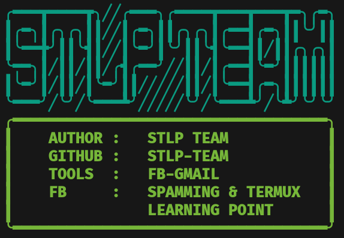
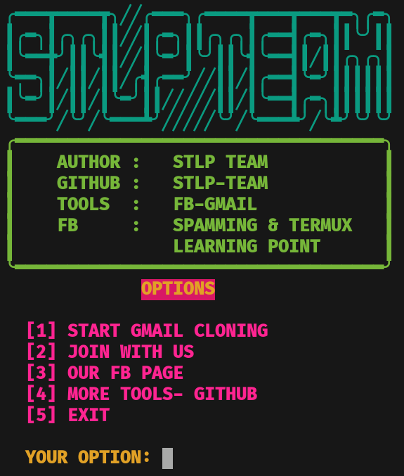

# FB-GMAIL
Best Facebook Gmail Id Clone Free Tools
<center><h3>🖤Assalamu Alaikum🖤</h3></center>
<center></img></center></br>

<h2>INSTALLATION ⬇️</h2>


```
pkg update -y
pkg upgrade -y
pkg install git -y
pkg install python -y
pip install requests bs4
cd && rm -rf FB-GMAIL
git clone https://github.com/STLP-TEAM/FB-GMAIL
cd FB-GMAIL
python STLP.py
```


<h3>SINGLE COMMAND</h3>

```
pkg update -y;pkg upgrade -y;pkg install git -y;pkg install python -y;pip install requests bs4;cd && rm -rf FB-GMAIL;git clone https://github.com/STLP-TEAM/FB-GMAIL;cd FB-GMAIL;python STLP.py
```


<h3>DEMO SS</h3>
<center></img></center></br>

<h3><a href="https://facebook.com/groups/spamming.termux.learning.point/"> ©️STLP-TEAM</a></h3>
